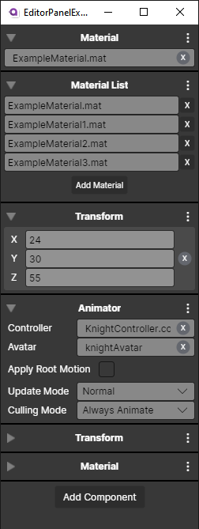

# Editor Panel Example

Personal project for demonstrating UI design and MVVM implementation using Avalonia UI (similar to WPF).

## Technologies Used

- [.NET 6.0](https://dotnet.microsoft.com/download/dotnet/6.0)
- [Avalonia 0.10.18](https://www.nuget.org/packages/Avalonia/0.10.18)

## Example

